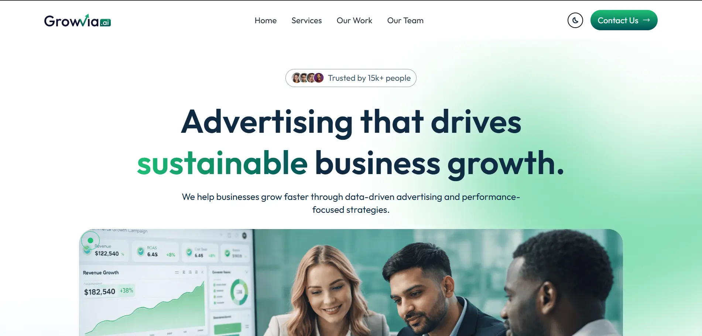
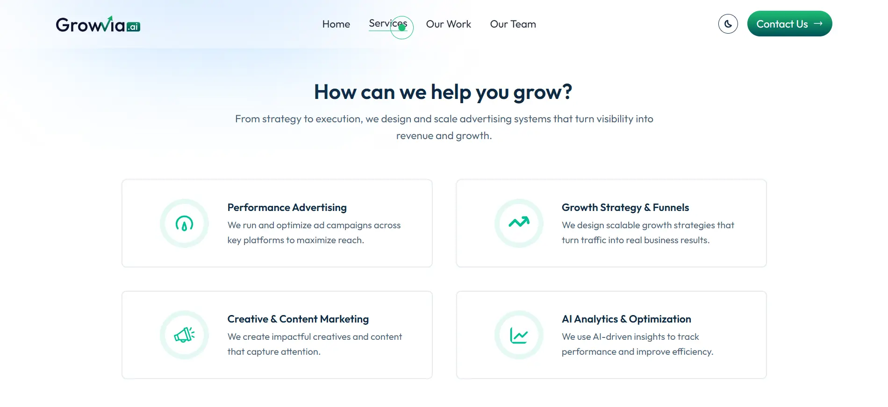
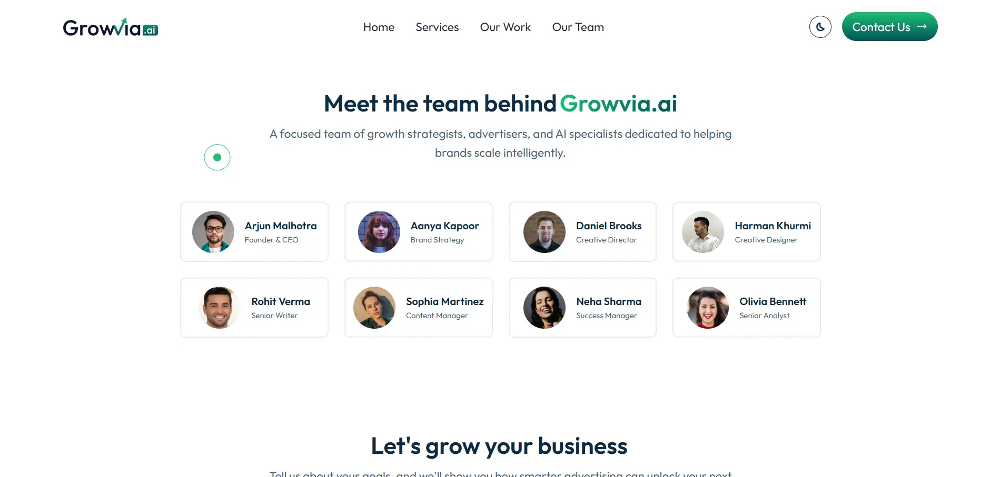

# GrowviaAI — AI-Powered Advertising Website

---

## 🚀 Project Overview

**GrowviaAI** is a modern, responsive website for an AI-powered advertising agency.  
This project was built as a **full-scale personal learning project** to showcase modern frontend development, UI/UX design, motion design, and performance optimization using the latest web technologies.

The entire project — including **branding, UI design, animations, and implementation** — was created from scratch. It represents a real-world, production-quality business website focused on growth marketing, performance advertising, creative strategy, and AI-driven analytics.

---

## 🌐 Live Demo

🔗 **Live Website**  
👉 **[GrowviaAI](https://growvia-ai.vercel.app/)**

---

## 🎯 Key Highlights

- Designed and developed completely from scratch
- Clean, professional UI suitable for a real business
- Motion-driven interactions and smooth animations
- Fully responsive and mobile-first
- Optimized assets and performance-focused build

---

## 🛠️ Tech Stack & Tools

### Frontend
- **React 19** — Component-based architecture
- **Vite 7** — Fast builds and development
- **Tailwind CSS 4** — Utility-first styling
- **Framer Motion 12** — Animations and transitions

### Libraries & Utilities
- React Icons
- React Hot Toast
- ESLint

### Design & Assets
- **Figma** — UI/UX design and prototyping
- Custom logos, illustrations, textures, and graphics

---

## ✨ Features

- Responsive design across all screen sizes
- Dark / Light theme toggle with persistence
- Animated navigation and mobile menu
- Scroll-triggered animations
- Custom animated cursor
- Interactive contact form with toast notifications
- Optimized images and assets
- Semantic HTML and accessibility-friendly structure

---

## 🎨 Design Process

All visuals were designed from scratch in **Figma**, including:

- GrowviaAI logo design
- Brand color palette and gradients
- Reusable UI components
- Layout system and interaction design

🔗 **Figma Design File**  
👉 **[Growvia.ai figma design](https://www.figma.com/design/19hEOjkMmu3udHZQu8Z8ng/Growvia.ai?node-id=0-1&t=ga7uQavmj8BkmwGn-1)**

---

## 📸 Screenshots & Mockups

### Hero Section

### Services Section

### Team Section

<!-- ### Design Mockups
 -->

---

<!-- ## 🎥 Video Preview

### Option 1 — GitHub-Hosted Video
 -->
